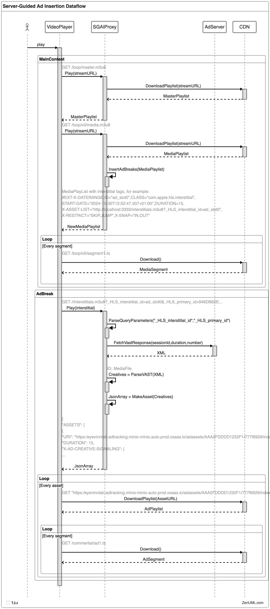

# Server-Guided Ad Insertion Proxy

[](https://app.osaas.io/browse/eyevinn-sgai-ad-proxy)

This application is a simple **http** proxy server that inserts ads into a video stream. It is designed to be used in conjunction with a video player (e.g., AVPlayer) that supports Server Guided Ad Insertion (SGAI). The proxy server intercepts the video stream from the origin server and inserts ads into the media playlist as interstitials at specified timepoints.

## Data Flow

The main data flow of Server-Guided Ad Insertion is shown below:


## Evaluate in Open Source Cloud

This project is also available as a web service in [Eyevinn Open Source Cloud](https://www.osaas.io) and the quickest way to get started.

Obtain your personal access token from the Open Source Cloud web console (settings/API) and store it in the environment variable `OSC_ACCESS_TOKEN`

```bash
% export OSC_ACCESS_TOKEN=<personal-access-token>
```

Create a test HLS live source.

```bash
% npx -y @osaas/cli create eyevinn-docker-testsrc-hls-live demo
Instance created:
{
  name: 'demo',
  url: 'https://eyevinnlab-demo.eyevinn-docker-testsrc-hls-live.auto.prod.osaas.io',
  ...
}
```

Create a test ad server instance.

```bash
% npx -y @osaas/cli create eyevinn-test-adserver demo
Instance created:
{
  name: 'demo',
  url: 'https://eyevinnlab-demo.eyevinn-test-adserver.auto.prod.osaas.io',
  ...
}
```

Create the SGAI ad proxy.

```bash
% npx -y @osaas/cli create eyevinn-sgai-ad-proxy demo \
  -o VastEndpoint="https://eyevinnlab-demo.eyevinn-test-adserver.auto.prod.osaas.io/api/v1/vast?dur=[template.duration]&uid=[template.sessionId]&ps=[template.pod]" \
  -o OriginUrl="https://eyevinnlab-demo.eyevinn-docker-testsrc-hls-live.auto.prod.osaas.io/loop/master.m3u8" \
  -o InsertionMode=dynamic
Instance created:
{
  name: 'demo',
  url: 'https://eyevinnlab-demo.eyevinn-sgai-ad-proxy.auto.prod.osaas.io',
  ...
}
```

In this example you have the proxied stream available at `https://eyevinnlab-demo.eyevinn-sgai-ad-proxy.auto.prod.osaas.io/loop/master.m3u8`

To insert ad breaks with the `curl` command:

```bash
% curl "https://eyevinnlab-demo.eyevinn-sgai-ad-proxy.auto.prod.osaas.io/command?in=0&dur=10&pod=2"
```

This command will insert an ad break at 0 seconds to the live edge with a duration of 10 seconds and a pod number of 2.

## Getting Started

### Prerequisites

* An HLS streaming server

```bash
# Use ffmpeg to create a simple HLS Live stream under the "test" directory
ffmpeg -y -re -stream_loop -1 -i sintel_trailer-1080p.mp4 \
  -preset slow -g 48 -sc_threshold 0 \
  -map 0:0 -map 0:1 -map 0:0 -map 0:1 \
  -s:v:0 640x360 -c:v:0 libx264 -b:v:0 365k \
  -s:v:1 960x540 -c:v:1 libx264 -b:v:1 2000k  \
  -c:a copy \
  -var_stream_map "v:0,a:0 v:1,a:1" \
  -master_pl_name master.m3u8 \
  -f hls -hls_time 4 -hls_list_size 8 -hls_flags round_durations+program_date_time+delete_segments \
  -hls_segment_filename "test/v%v/fileSequence%d.ts" test/v%v/media.m3u8

# Serve the HLS Live stream using a simple http server *above* the "test" directory
python -m http.server 8001

# Now you can access the HLS stream at http://127.0.0.1:8001/test/master.m3u8
```

* A running instance of the [Ad Server](https://github.com/Eyevinn/test-adserver) OR [Ad Normalizer](https://github.com/Eyevinn/ad-normalizer).

* QuickTime Player or any other video player (e.g., AVPlayer, [HLS.js v1.6.0](https://hlsjs-dev.video-dev.org/demo)) that supports Server Guided Ad Insertion (SGAI).

```bash
# Once the ad-proxy server is running (e.g., on port 3333), 
# you can play the proxied HLS stream
```

### Run

```bash
# Start the ad-proxy server on port 3333 with the origin HLS stream at http://localhost:8001/test/master.m3u8
# 1. Use ad normalizer at https://eyevinnlab-demo.eyevinn-ad-normalizer.auto.prod.osaas.io/api/v1/vast with query parameters dur, uid, ps, min, and max
# Here the [template.*] will be replaced with the actual values before sending the request to the ad server while the rest will be passed as is
# 2. Use static mode to insert ads into the HLS Live stream at specified timepoints
# 3. Use http://localhost:3333 as the base URL for interstitials (by default)
cargo run --bin ad_proxy 127.0.0.1 3333 http://localhost:8001/test/master.m3u8 \
https://eyevinnlab-demo.eyevinn-ad-normalizer.auto.prod.osaas.io/api/v1/vast?dur=[template.duration]&uid=[template.sessionId]&ps=[template.pod]&min=5&max=5 \
--ad-insertion-mode static

# Now you can access the HLS Live stream at http://127.0.0.1:3333/test/master.m3u8
# NOTE: Each proxy server instance can only handle one HLS Live stream at a time and restart is required to switch streams
```

For more options, run `ad_proxy --help`

```bash
Usage: ad_proxy [OPTIONS] <LISTEN_ADDR> <LISTEN_PORT> <MASTER_PLAYLIST_URL> <AD_SERVER_ENDPOINT>

Arguments:
  <LISTEN_ADDR>          Proxy address (ip)
  <LISTEN_PORT>          Proxy port
  <MASTER_PLAYLIST_URL>  HLS stream address (protocol://ip:port/path)
                         (e.g., http://localhost/test/master.m3u8)
  <AD_SERVER_ENDPOINT>   Ad server endpoint (protocol://ip:port/path)
                         It should be a VAST4.0/4.1 XML compatible endpoint

Options:
  -a, --ad-insertion-mode <AD_INSERTION_MODE>
          Ad insertion mode to use:
          1) static  - add interstitial every 30 seconds (1000 in total).
          2) dynamic - add interstitial when requested (Live Content only). [default: static] [possible values: static, dynamic]
  -i, --interstitials-address <INTERSTITALS_ADDRESS>
          Base URL for interstitials (protocol://ip:port)
          If not provided, the server will use 'localhost' and the 'listen port' as the base URL
          e.g., http://localhost:${LISTEN_PORT} [default: ]
      --default-ad-duration <DEFAULT_AD_DURATION>
          Default ad break duration in seconds [env: DEFAULT_AD_DURATION=] [default: 13]
      --default-repeating-cycle <DEFAULT_REPEATING_CYCLE>
          Repeat the ad break every 'n' seconds [env: DEFAULT_REPEATING_CYCLE=] [default: 30]
      --default-ad-number <DEFAULT_AD_NUMBER>
          Default number of ad slots to generate [env: DEFAULT_AD_NUMBER=] [default: 1000]
      --test-asset-url <TEST_ASSET_URL>
          Replace raw MP4 assets with this test assets (it has to be a fragmented MP4 VoD **MEDIA** playlist)
          e.g., https://s3.amazonaws.com/qa.jwplayer.com/hlsjs/muxed-fmp4/hls.m3u8 [env: TEST_ASSET_URL=] [default: ]
```

### Insert Ads Dynamically

One can run the ad-proxy in *dynamic* mode and then insert ads into the video stream by sending a GET request with the following query parameters:

* in - the time in seconds when the ad break should be inserted
* duration - the duration of the ad break in seconds
* pod_num - the number of creatives in this ad break

For example, to insert an ad break at 5 seconds from the live-edge with a duration of 10 seconds and 2 creatives, one would send the following request:

```bash
curl http://127.0.0.1:3333/command?in=5&dur=10&pod=2
```

It is also possible to check the status of the proxy server by sending a GET request:  

```bash
curl http://127.0.0.1:3333/status
```

### Ad Personalization

Instead of relying on personalized playlist, ad personalization can be achieved by using query parameters in:

1. **Ad Server URL**: The ad server endpoint can include query parameters that will be dynamically replaced with actual values before sending the request. For example, in the ad server endpoint `https://eyevinn-sgai.eyevinn-test-adserver.auto.prod.osaas.io/api/v1/vast?dur=[template.duration]&uid=[template.sessionId]&ps=[template.pod]&min=5&max=5`, the query parameters `dur`, `uid`, and `ps` will be replaced with actual values, while `min` and `max` will remain unchanged. These values apply to ad requests for **all** playback sessions.

2. **Master Playlist URL**: Player can use a custom master playlist URL which includes query parameters to be forwarded to the ad server. For example, if a client initializes the playback with URL `http://127.0.0.1:3333/loop/master.m3u8?customString=abc`, the query parameter `customString` will be appended to the ad server request, resulting in `https://eyevinn-sgai.eyevinn-test-adserver.auto.prod.osaas.io/api/v1/vast?dur=[template.duration]&uid=[template.sessionId]&ps=[template.pod]&min=5&max=5&customString=abc`. It is worth noting that this **only** applies to a specific playback session as AVPlayer and Safari support setting the 'X-PLAYBACK-SESSION-ID' request header and '_HLS_primary_id' query parameter of interstitial requests with a common, globally-unique value on every HTTP request associated with a particular playback session.

### Example Modified Media Playlist

```m3u8
#EXTM3U
#EXT-X-TARGETDURATION:4
#EXT-X-MEDIA-SEQUENCE:11
#EXT-X-PROGRAM-DATE-TIME:2024-10-30T12:52:27.853+0100
#EXTINF:4,
fileSequence11.ts
#EXT-X-PROGRAM-DATE-TIME:2024-10-30T12:52:31.853+0100
#EXTINF:4,
fileSequence12.ts
#EXT-X-PROGRAM-DATE-TIME:2024-10-30T12:52:35.853+0100
#EXTINF:4,
fileSequence13.ts
#EXT-X-PROGRAM-DATE-TIME:2024-10-30T12:52:39.853+0100
#EXTINF:4,
fileSequence14.ts
#EXT-X-PROGRAM-DATE-TIME:2024-10-30T12:52:43.853+0100
#EXTINF:4,
fileSequence15.ts
#EXT-X-DATERANGE:ID="ad_slot0",CLASS="com.apple.hls.interstitial",START-DATE="2024-10-30T12:52:47.207+01:00",DURATION=30,X-ASSET-LIST="http://localhost:3333/interstitials.m3u8?_HLS_interstitial_id=ad_slot0",X-RESTRICT="SKIP,JUMP",X-SNAP="IN,OUT"
#EXT-X-PROGRAM-DATE-TIME:2024-10-30T12:52:47.853+0100
#EXTINF:4,
fileSequence16.ts
#EXT-X-PROGRAM-DATE-TIME:2024-10-30T12:52:51.853+0100
#EXTINF:4,
fileSequence17.ts
#EXT-X-PROGRAM-DATE-TIME:2024-10-30T12:52:55.853+0100
#EXTINF:4,
fileSequence18.ts
```

### Example JSON response for interstitials

``` json
{
  "ASSETS": [
    {
      "URI": "https:/eyevinnlab-adtracking.minio-minio.auto.prod.osaas.io/adassets/AAA2FDDDD1232F1/777f6929-ce6f-4712-82d9-aba2da6fd5c2/index.m3u8",
      "DURATION": 10,
      "X-AD-CREATIVE-SIGNALING": {
        "version": 2,
        "type": "slot",
        "payload": {
          "type": "linear",
          "start": 0,
          "duration": 10,
          "identifiers": [
            {
              "scheme": "test-ad-id.eyevinn",
              "value": "AAA%2FBBBB123%2F1"
            }
          ],
          "tracking": [
            {
              "type": "start",
              "urls": [
                "http://eyevinnlab-adtracking.eyevinn-test-adserver.auto.prod.osaas.io/api/v1/sessions/158281fa-8ef1-43b2-a04c-057ee854cdeb/tracking?adId=alvedon-10s_1&progress=0"
              ]
            },
            {
              "type": "firstQuartile",
              "urls": [
                "http://eyevinnlab-adtracking.eyevinn-test-adserver.auto.prod.osaas.io/api/v1/sessions/158281fa-8ef1-43b2-a04c-057ee854cdeb/tracking?adId=alvedon-10s_1&progress=25"
              ]
            },
            {
              "type": "midpoint",
              "urls": [
                "http://eyevinnlab-adtracking.eyevinn-test-adserver.auto.prod.osaas.io/api/v1/sessions/158281fa-8ef1-43b2-a04c-057ee854cdeb/tracking?adId=alvedon-10s_1&progress=50"
              ]
            },
            {
              "type": "thirdQuartile",
              "urls": [
                "http://eyevinnlab-adtracking.eyevinn-test-adserver.auto.prod.osaas.io/api/v1/sessions/158281fa-8ef1-43b2-a04c-057ee854cdeb/tracking?adId=alvedon-10s_1&progress=75"
              ]
            },
            {
              "type": "complete",
              "urls": [
                "http://eyevinnlab-adtracking.eyevinn-test-adserver.auto.prod.osaas.io/api/v1/sessions/158281fa-8ef1-43b2-a04c-057ee854cdeb/tracking?adId=alvedon-10s_1&progress=100"
              ]
            }
          ]
        }
      }
    }
  ],
  "X-AD-CREATIVE-SIGNALING": {
    "version": 2,
    "type": "pod",
    "payload": {
      "duration": 10
    }
  }
}
```

## Limitations

* In order to place the interstitials at the correct timepoints, the origin media playlist should contain the `EXT-X-PROGRAM-DATE-TIME` tag. For Live stream, the origin media playlist will be returned
if this tag is not found so no interstitials will be inserted. For VoD, the proxy server will try to use its starting time as reference if the `EXT-X-PROGRAM-DATE-TIME` tag is not found.
* The creatives from test ad server are mostly regular MPEG-4 files (ftyp+moov+mdat). While AVPlayer can handle regular MP4 files, other video player like hls.js or media3player(Android) can only handle fragmented MPEG-4 files (ftyp+moov+moof+mdat+moof+mdat+…). Therefore, it would fail to play out the interstitials.
Ideally, raw MP4 creatives should be transcoded to fMP4 or TS files first. One can use the [Encore](https://github.com/svt/encore) to transocde them into HLS stream or use the [Ad Normalizer](https://app.osaas.io/dashboard/service/eyevinn-ad-normalizer) to fetch transcoded creatives directly.
Alternatively, one can use the `--test-asset-url` option to replace the raw MP4 assets' url with a test asset URL that contains a fragmented MP4 VoD **MEDIA** playlist. For example, `https://s3.amazonaws.com/qa.jwplayer.com/hlsjs/muxed-fmp4/hls.m3u8`.
* When a client joins the live stream during an ad break, it should append the request with *_HLS_start_offset* query parameter to indicate the offset in seconds of the playback start point from the beginning of the interstitial. One can use this to customize interstitial content based on the starting offset.
* The proxy server can only handle one HLS stream at a time. To switch streams, the server must be restarted.

## License (Apache-2.0)

Copyright 2023 Eyevinn Technology AB

Licensed under the Apache License, Version 2.0 (the "License");
you may not use this file except in compliance with the License.
You may obtain a copy of the License at

``` text
  http://www.apache.org/licenses/LICENSE-2.0
```

Unless required by applicable law or agreed to in writing, software
distributed under the License is distributed on an "AS IS" BASIS,
WITHOUT WARRANTIES OR CONDITIONS OF ANY KIND, either express or implied.
See the License for the specific language governing permissions and
limitations under the License.

## Support

Join our [community on Slack](http://slack.streamingtech.se) where you can post any questions regarding any of our open source projects. Eyevinn's consulting business can also offer you:

* Further development of this component
* Customization and integration of this component into your platform
* Support and maintenance agreement

Contact [sales@eyevinn.se](mailto:sales@eyevinn.se) if you are interested.

## About Eyevinn Technology

Eyevinn Technology is an independent consultant firm specialized in video and streaming. Independent in a way that we are not commercially tied to any platform or technology vendor.

At Eyevinn, every software developer consultant has a dedicated budget reserved for open source development and contribution to the open source community. This gives us room for innovation, team building and personal competence development. And also gives us as a company a way to contribute back to the open source community.

Want to know more about Eyevinn and how it is to work here. Contact us at <work@eyevinn.se>!
